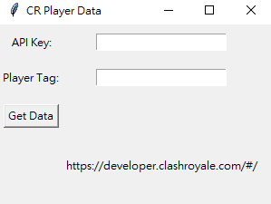
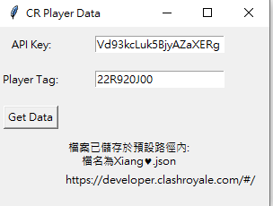

{: .normal }
{: .normal }
{: .normal }
{: .normal }


Users must obtain the corresponding API key to use. Please go to [Official Document](https://developer.clashroyale.com/#/)  
If you like my project, please consider giving it a star. [GitHub](https://github.com/Xiang511/CR-API) 


## Features 
-  Search Clan information
-  Search Player information  
-  Search local rankings 
-  Search player achievement records

## Example Usage
Here are some example code samples.

More code can be found on [GitHub](https://github.com/Xiang511/CR-API)

DEMO : [https://www.youtube.com/watch?v=BKnR_kre6QI&ab_channel=XiangFang](https://www.youtube.com/watch?v=BKnR_kre6QI&ab_channel=XiangFang)

### FindClan.py
> Search Clan information
{: .block-tip }

```python
import requests
import pandas as pd
import time

#Calculate starting time
start_time = time.time()

# Enter your key
# Go to https://developer.clashroyale.com/#/ 

API_KEY = ""
headers = {
    "Authorization": "Bearer {}".format(API_KEY)
}

# GET ClanTag
#ex: %23QCRY22P8

clan_tag = "%23QCRY22P8"


url = "https://api.clashroyale.com/v1/clans/{}".format(clan_tag)
response = requests.get(url, headers=headers)


try:
    if response.status_code == 200:
        clan = response.json()

        df = pd.DataFrame(clan["memberList"])
        df.to_excel("FindClan.xlsx")

        
        end_time = time.time()
        
        print(f"Time：{end_time - start_time}")
    else:
        print(response.status_code)
except Exception as e:
    print(e)
```
----------------
### Player.py
> Search Player information  
{: .block-tip }

```python
import openpyxl
import requests
import json
import time
from tqdm import tqdm

#Calculate starting time
start_time = time.time()

# Enter your key
# Go to https://developer.clashroyale.com/#/ 
API_KEY = ""

headers = {
    "Authorization": "Bearer {}".format(API_KEY)
}

# enter your tag
# ex: '%2322R920J00','%2312345678'

player_tags = ["%2322R920J00", "%23V99082R9C"]


wb = openpyxl.Workbook()
ws = wb.active

ws["A1"] = "Tag"
ws["B1"] = "BEST"
ws["C1"] = "LAST"


def clean_result(result):
    if result is None:
        return ""
    return result[result.rfind(" ") + 1:].split("}")[0]
#ex:
#   best = json.dumps(player_data.get("bestPathOfLegendSeasonResult"))
#   回傳值為{"leagueNumber": 10, "trophies": 2416, "rank": 2573}
#
#   另 best2 = clean_result(best)
#   則 best2 = 2573

for player_tag in tqdm(player_tags):

    response = requests.get(f"https://api.clashroyale.com/v1/players/{player_tag}", headers=headers)
    
    player_data = response.json()

    best = json.dumps(player_data.get("bestPathOfLegendSeasonResult"))
    last = json.dumps(player_data.get("lastPathOfLegendSeasonResult"))

    best2 = clean_result(best)
    last2= clean_result(last)

    ws.append([
    player_data["name"],
    best2,
    last2])

wb.save("Player.xlsx")

#Calculate end time
end_time = time.time()
print(f"Time：{end_time - start_time}")
````
------------
### LocalRanking
> Search local rankings
{: .block-tip }

```python
import requests
import openpyxl
import datetime
import time
from tqdm import tqdm

#Calculate starting time
start_time = time.time()

#Enter your key
#Go to https://developer.clashroyale.com/#/ 

API_KEY = ""
headers = {
    "Authorization": "Bearer {}".format(API_KEY)
}

response = requests.get(
    "https://api.clashroyale.com/v1/locations/57000228/pathoflegend/players",
    headers=headers,
)

#How do I know my area code? ex:57000228
#Check Area Code File

#Get Time
now = datetime.datetime.now()
now_str = now.strftime("%Y-%m-%d")

wb = openpyxl.Workbook() 
ws = wb.active

ws.cell(row=1, column=1).value = "ID"
ws.cell(row=1, column=2).value = "Name"
ws.cell(row=1, column=3).value = "Rating"

row_number = 2
for player in tqdm(response.json()["items"]):
    ws.cell(row=row_number, column=1).value = player["tag"]
    ws.cell(row=row_number, column=2).value = player["name"]
    ws.cell(row=row_number, column=3).value = player["eloRating"]
    row_number += 1

wb.save(now_str+".xlsx")

#Calculate end time
end_time = time.time()
print(f"Time：{end_time - start_time}")
```

----------------
### PlayerProfile
> Search player achievement records
{: .block-tip }

```python
import openpyxl
import requests
import time
from tqdm import tqdm

#Calculate starting time
start_time = time.time()

#Enter your key
#Go to https://developer.clashroyale.com/#/ 

API_KEY = ""
headers = {
    "Authorization": "Bearer {}".format(API_KEY)
}

#Enter your tag
#ex: '%2322R920J00','%2312345678'

player_tags = ['%2322R920J00']
              
wb = openpyxl.Workbook()
ws = wb.active

ws["A1"] = "Tag"
ws["B1"] = "Classic12Wins"
ws["C1"] = "Grand12Wins"
ws["D1"] = "YearsPlayed"
ws["E1"] = "EmoteCollection"
ws["F1"] = "BannerCollection"
ws["G1"] = "starPoints"
ws["H1"] = "totalExpPoints"


for player_tag in tqdm(player_tags):
    response = requests.get(f"https://api.clashroyale.com/v1/players/{player_tag}", headers=headers)
    
    player_data = response.json()

    Classic12WinsCout =0 
    Grand12WinsCout = 0

    starPoints = player_data["starPoints"]
    totalExpPoints = player_data["totalExpPoints"]
    
    for Classic12Wins in player_data["badges"]:
       if Classic12Wins["name"] == "Classic12Wins":
        Classic12WinsCout = Classic12Wins["progress"]

    for Grand12Wins in player_data["badges"]:
       if Grand12Wins["name"] == "Grand12Wins":
        Grand12WinsCout = Grand12Wins["progress"]

    for YearsPlayed in player_data["badges"]:
       if YearsPlayed["name"] == "YearsPlayed":
        YearsPlayedCout = YearsPlayed["progress"]

    for EmoteCollection in player_data["badges"]:
       if EmoteCollection["name"] == "EmoteCollection":
        EmoteCollectionCout = EmoteCollection["progress"]

    for BannerCollection in player_data["badges"]:
       if BannerCollection["name"] == "BannerCollection":
        BannerCollectionCout = BannerCollection["progress"]


    # for PracticewithFriendsCout in player_data["achievements"]:
    #   if PracticewithFriendsCout["name"] == "Practice with Friends":
    #     PracticewithFriendsCoutCout = PracticewithFriendsCout["value"]

    ws.append([
    player_data["name"],Classic12WinsCout,Grand12WinsCout,YearsPlayedCout,EmoteCollectionCout,BannerCollectionCout,starPoints,totalExpPoints
    ])

wb.save("PlayerProfile.xlsx")

#Calculate end time
end_time = time.time()
print(f"Time：{end_time - start_time}")
```


## Under development

Providing a GUI interface for a program. The following is an example.

| before | after |
|  |  |


## License 

This work is open source under the MIT License.

Copyright © 2024 Li Xiang 

